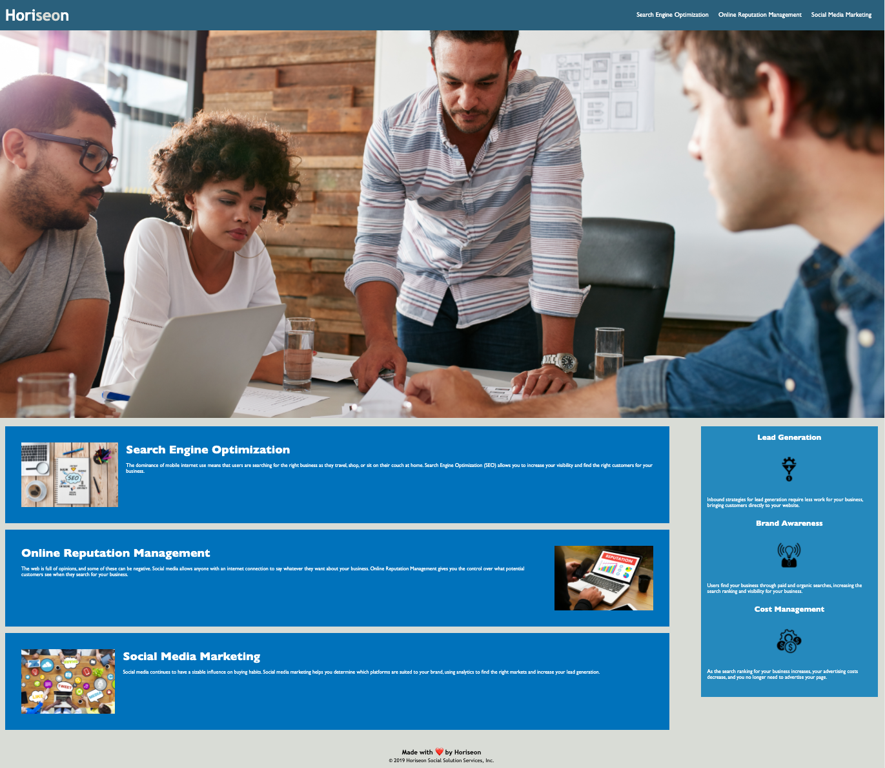

# accessibility-enhancement (code refactored by Manzur Shaheed)

## Description

Refactor provided code with HTML semantic elements to have an independent logical structure, heading attributes are in sequential order, CSS styles consolidation and with comments, working links and a screenshot of deployed application.

## Deployment
**Code:** https://github.com/manzur-shaheed/accessibility-enhancement
**Link:** https://manzur-shaheed.github.io/accessibility-enhancement/

The following image shows the web application's appearance and functionality:

